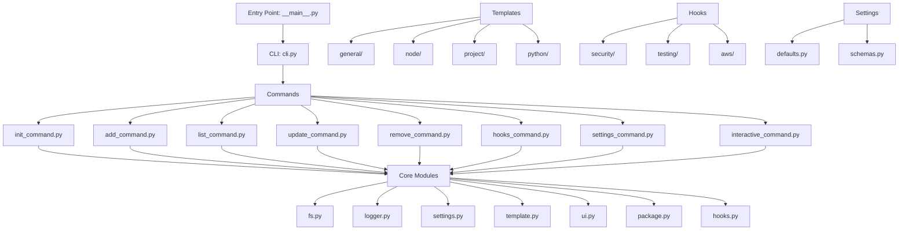
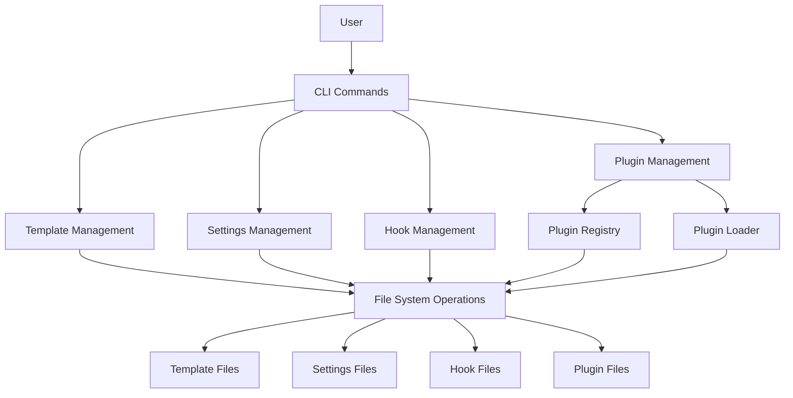
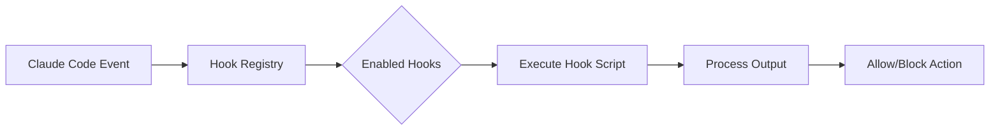

# Claude Code Setup Architecture

This document describes the architectural design of the Claude Code Setup tool, explaining its components, their relationships, and how data flows through the system.

## System Overview

Claude Code Setup is organized as a modular Python CLI application with a clean separation of concerns between command definition, business logic, and utility functions. The architecture follows a command-based pattern using Click as its foundation, with specialized modules handling different aspects of the application's functionality.



## Core Components

### Command Structure

The application uses a hierarchical command structure:

1. **Entry Point**: `__main__.py` serves as the package entry point when run with `python -m`
2. **CLI Module**: `cli.py` defines the root Click group and registers all commands
3. **Command Modules**: Specialized modules implement specific command functionality
   - `init_command.py`: Handles initialization of Claude Code configuration
   - `add_command.py`: Adds templates, hooks, permissions, and environment variables
   - `list_command.py`: Lists available templates, hooks, and settings
   - `update_command.py`: Updates templates and settings to latest versions
   - `remove_command.py`: Removes templates, permissions, and hooks
   - `hooks_command.py`: Manages hook installation and configuration
   - `settings_command.py`: Manages themes, environment variables, and permissions
   - `interactive_command.py`: Provides guided interactive workflows

Each command follows a consistent pattern:
- Definition with Click decorators
- Options with type hints and help text
- Async/sync action handlers that implement the command logic
- Interactive and non-interactive modes for flexibility
- Comprehensive error handling with user-friendly messages

### Template Management

Templates are stored as Markdown files organized by category:

1. **Template Registry**: Registry class maintaining available templates
2. **Template Loading**: Dynamic loading from the package's template directory
3. **Template Operations**: Add, list, update, and remove functionality
4. **Category Organization**: Templates grouped by purpose (general, node, project, python)

Templates flow through the system as follows:
1. Files are packaged with the Python distribution in `src/claude_code_setup/templates/`
2. Loaded into the template registry via `TemplateRegistry.get_templates()`
3. Presented to users via the list command with rich formatting
4. Installed to the user's `.claude/commands/` directory when added
5. Updated when newer versions are available through the update command

### Settings Management

Settings are stored as JSON files with a hierarchical structure:

1. **Default Settings**: Base settings defined in `defaults.py`
2. **User Settings**: Customizations stored in `.claude/settings.json`
3. **Merged Settings**: Runtime combination of defaults and user settings

The settings system handles:
- Permission sets for tool access
- UI themes (default, dark)
- Environment variables
- Hook configurations
- Settings validation using Pydantic models

### File System Operations

The file system layer abstracts disk operations:

1. **Directory Management**: Creating, validating, and managing the `.claude` directory structure
2. **Template I/O**: Reading and writing template files
3. **Settings I/O**: Reading and writing settings files
4. **Path Resolution**: Handling global vs. local paths



## Data Flow

The typical data flow for commands follows this pattern:

1. **Command Invocation**: User runs a command with options
2. **Path Resolution**: System determines whether to use local or global directories
3. **Data Loading**: Existing templates or settings are loaded if needed
4. **Command Processing**: The specific operation is performed
5. **Feedback**: Results are displayed to the user with appropriate formatting

For interactive commands, the flow includes additional steps:
1. **User Prompts**: System presents options via Questionary
2. **Selection Processing**: User choices are validated and processed
3. **Multi-step Interaction**: For complex operations like initialization
4. **Progress Indication**: Rich progress bars and spinners for long operations

### Hook Management

The hook system provides extensibility for Claude Code:

1. **Hook Registry**: Central registry of available hooks
2. **Hook Loading**: Dynamic discovery from the hooks directory
3. **Hook Installation**: Copying hook files to user's configuration
4. **Event System**: Hooks respond to specific Claude Code events
5. **Configuration**: Hook-specific settings passed through settings.json

Hook architecture:


## Key Design Patterns

1. **Command Pattern**: Each CLI command is encapsulated in its own module
2. **Registry Pattern**: Templates and hooks are stored in registries for easy lookup
3. **Factory Pattern**: Settings are created and merged dynamically
4. **Adapter Pattern**: Different file operations are abstracted behind a common interface
5. **Strategy Pattern**: Different modes (interactive vs. direct) for command execution
6. **Observer Pattern**: Hooks observe and respond to Claude Code events

## Python-Specific Architecture

### Package Structure
The application is packaged as a standard Python distribution:
- Entry point defined in `pyproject.toml`
- Package data includes templates and hooks
- Dependencies managed through `requirements.txt`

### Async Support
- Commands can be either sync or async
- Async commands use Python's asyncio for concurrent operations
- Click handles async transparently with proper event loop management

### Type Safety
- Comprehensive type hints throughout the codebase
- Pydantic models for data validation
- MyPy for static type checking

### Plugin System

The plugin system provides modular extensibility:

1. **Plugin Registry**: Central registry tracking plugin installations, versions, and states
2. **Plugin Loader**: Dynamic plugin discovery and loading from repository and installed directories
3. **Plugin Manifest**: YAML-based metadata defining capabilities and dependencies
4. **Plugin States**: Available, Installed, Active, Disabled, Error states
5. **Dependency Resolution**: Semantic versioning for plugin dependencies
6. **Bundle Support**: Grouping related plugins for easy installation

```python
# Plugin architecture
src/claude_code_setup/plugins/
├── __init__.py
├── types.py          # Pydantic models for plugins
├── registry.py       # Plugin registry management
├── loader.py         # Plugin loading and activation
├── repository/       # Available plugins
└── bundles/          # Plugin bundle definitions
```

Key features:
- **Template Integration**: Plugins can provide namespaced templates
- **Hook Integration**: Plugins can register hooks in settings
- **Version Management**: Semantic versioning with compatibility checks
- **Isolation**: Each plugin operates in its own directory
- **Hot Loading**: Activate/deactivate plugins without restart

### Performance Optimizations
- Lazy loading of templates and hooks
- Efficient JSON parsing with Python's built-in library
- Minimal dependencies for fast startup
- Cached plugin registry for quick access

## Error Handling

Error handling follows a consistent approach throughout the application:
1. Commands use try/except blocks to capture errors
2. Custom exceptions provide context-specific error information
3. Error messages are logged with the logger utility
4. User-friendly error messages are displayed with Rich formatting
5. Process exits with appropriate exit codes for command-line error reporting
6. Validation errors provide helpful suggestions for fixes

## Testing Architecture

The testing strategy includes:
1. **Unit Tests**: Test individual functions and classes in isolation
2. **Integration Tests**: Test command workflows end-to-end
3. **Docker Tests**: Test package installation in clean environments
4. **Fixture System**: Pytest fixtures for test data and temporary directories
5. **Mock System**: Mock external dependencies for predictable tests

This architecture ensures a maintainable, performant, and extensible system that leverages Python's strengths while providing a superior user experience compared to the original TypeScript implementation.